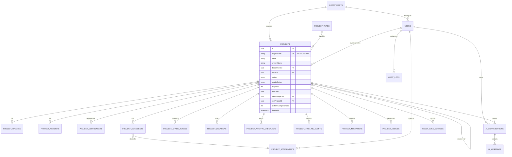

# 02 · 数据库设计与 ER 图

> PostgreSQL 16 · Prisma 6 · UTC 存储 · 全部结构变更走 migration

---

## 1. ER 总览



**共 20 张业务表。** 关系密度最高的 `projects` 是系统第一核心对象。

---

## 2. 表清单

| # | 表 | 用途 | 关键约束 |
|---|----|----|---------|
| 1 | `users` | 用户 | `username` unique |
| 2 | `departments` | 需求部门 | `code` unique |
| 3 | `project_types` | 项目类型 | `code` unique |
| 4 | `project_sequence` | 项目编号序列 | `year` PK，行锁 |
| 5 | `projects` | **项目核心** | `projectCode` unique |
| 6 | `project_updates` | 项目更新流 | `projectId` FK + index |
| 7 | `project_versions` | 系统版本 | `projectId` FK |
| 8 | `project_attachments` | 物理文件（storageKey） | `storageKey` unique |
| 9 | `project_documents` | 文档元数据（业务语义） | `projectId` FK + `isCurrent` |
| 10 | `project_deployments` | 部署环境 | `projectId` + `environment` |
| 11 | `project_share_tokens` | 分享 Token | `token` unique |
| 12 | `project_migrations` | 部门迁移记录 | append-only |
| 13 | `project_merges` | 合并记录 | append-only |
| 14 | `project_relations` | 项目关系 | 三字段 unique |
| 15 | `project_archive_checklists` | 归档检查项 | `projectId`+`itemKey` unique |
| 16 | `project_timeline_events` | 时间线事件 | `projectId` + `occurredAt` index |
| 17 | `audit_logs` | 审计日志 | append-only |
| 18 | `ai_conversations` | AI 会话 | `userId` FK |
| 19 | `ai_messages` | AI 消息 + 来源 | `conversationId` FK |
| 20 | `knowledge_sources` | 知识同步状态（预留） | `projectId` FK |
| 21 | `ai_settings` | AI 配置（单实例） | 单行 |

---

## 3. 完整 Prisma Schema（骨架）

```prisma
// prisma/schema.prisma
generator client { provider = "prisma-client-js" }
datasource db    { provider = "postgresql"; url = env("DATABASE_URL") }

// ─────────────── Enums ───────────────
enum Role           { ADMIN MASTER USER }
enum ProjectStatus  { DRAFT PLANNED IN_PROGRESS WAITING_ACCEPTANCE COMPLETED ARCHIVED ON_HOLD CANCELLED MERGED }
enum HealthStatus   { NORMAL AT_RISK DELAYED ON_HOLD }
enum Priority       { P0 P1 P2 P3 }
enum SystemStatus   { ACTIVE MAINTENANCE DEPRECATED OFFLINE UNKNOWN }
enum Environment    { DEVELOPMENT TESTING STAGING PRODUCTION }
enum DeploymentStatus { ACTIVE MAINTENANCE DEPRECATED OFFLINE UNKNOWN }
enum RelationType   { PARENT_CHILD BRANCH RELATED MERGED MIGRATED }
enum AttachmentType { DOCUMENT SCREENSHOT DEPLOYMENT REQUIREMENT TESTING ACCEPTANCE OTHER }
enum TimelineEventType {
  PROJECT_CREATED STATUS_CHANGED UPDATE_ADDED OVERDUE_DETECTED
  OWNER_CHANGED DEPARTMENT_MIGRATED PROJECT_MERGED PROJECT_BRANCHED
  COMPLETED ACCEPTED ARCHIVED DOCUMENT_UPLOADED VERSION_RELEASED
  DEPLOYMENT_CHANGED SHARE_CREATED SHARE_REVOKED RESTORED
}
enum SyncStatus { PENDING SYNCED FAILED }

// ─────────────── 组织 ───────────────
model Department {
  id          String   @id @default(uuid()) @db.Uuid
  code        String   @unique
  name        String
  description String?
  sortOrder   Int      @default(0)
  isActive    Boolean  @default(true)
  createdAt   DateTime @default(now())
  updatedAt   DateTime @updatedAt
  deletedAt   DateTime?
  users       User[]
  projects    Project[]
  migrationsFrom ProjectMigration[] @relation("MigrationFrom")
  migrationsTo   ProjectMigration[] @relation("MigrationTo")
  @@index([isActive, sortOrder])
}

model User {
  id            String    @id @default(uuid()) @db.Uuid
  username      String    @unique
  email         String?   @unique
  displayName   String
  passwordHash  String
  role          Role      @default(USER)
  departmentId  String?   @db.Uuid
  isActive      Boolean   @default(true)
  lastLoginAt   DateTime?
  createdAt     DateTime  @default(now())
  updatedAt     DateTime  @updatedAt
  deletedAt     DateTime?

  department    Department? @relation(fields: [departmentId], references: [id], onDelete: SetNull)

  ownedProjects     Project[] @relation("ProjectOwner")
  createdProjects   Project[] @relation("ProjectCreator")
  developedProjects Project[] @relation("ProjectDeveloper")
  maintainedProjects Project[] @relation("ProjectMaintainer")
  acceptedProjects  Project[] @relation("ProjectAcceptor")
  archivedProjects  Project[] @relation("ProjectArchiver")
  updates           ProjectUpdate[]
  attachments       ProjectAttachment[]
  documents         ProjectDocument[]
  shareTokens       ProjectShareToken[]
  migrations        ProjectMigration[]
  merges            ProjectMerge[]
  relations         ProjectRelation[]
  checklistItems    ProjectArchiveChecklist[]
  timelineEvents    ProjectTimelineEvent[]
  auditLogs         AuditLog[]
  aiConversations   AiConversation[]
  aiSettingsEditor  AiSettings[] @relation("AiSettingsEditor")

  @@index([role, isActive])
  @@index([departmentId])
}

model ProjectType {
  id          String   @id @default(uuid()) @db.Uuid
  code        String   @unique
  name        String
  color       String?
  description String?
  sortOrder   Int      @default(0)
  isActive    Boolean  @default(true)
  createdAt   DateTime @default(now())
  updatedAt   DateTime @updatedAt
  deletedAt   DateTime?
  projects    Project[]
  @@index([isActive, sortOrder])
}

// ─────────────── 编号序列 ───────────────
model ProjectSequence {
  year       Int @id
  lastValue  Int @default(0)
  updatedAt  DateTime @updatedAt
}

// ─────────────── 核心：Project ───────────────
model Project {
  id          String   @id @default(uuid()) @db.Uuid
  projectCode String   @unique              // PRJ-2026-0001
  name        String
  shortName   String?
  systemName  String?                       // 可不同于项目名

  description String?  @db.Text
  objective   String?  @db.Text             // 为什么做
  requirement String?  @db.Text             // Markdown
  acceptanceCriteria Json?                  // [{ text, done }]

  departmentId   String @db.Uuid
  projectTypeId  String @db.Uuid
  ownerId        String @db.Uuid
  creatorId      String @db.Uuid
  originalDeveloperId String? @db.Uuid
  currentMaintainerId String? @db.Uuid

  priority     Priority      @default(P2)
  status       ProjectStatus @default(DRAFT)
  healthStatus HealthStatus  @default(NORMAL)
  progress     Int           @default(0)    // 0-100，与 healthStatus 独立

  startDate          DateTime? @db.Date
  dueDate            DateTime? @db.Date
  actualCompletedDate DateTime? @db.Date
  acceptanceDate     DateTime? @db.Date
  acceptedById       String?  @db.Uuid
  acceptanceNote     String?  @db.Text
  cancelledReason    String?  @db.Text

  // 谱系
  parentProjectId String? @db.Uuid
  rootProjectId   String? @db.Uuid

  // 软件资产
  systemStatus    SystemStatus @default(UNKNOWN)
  currentVersion  String?
  offlinedAt      DateTime?
  offlineReason   String?      @db.Text
  replacedByProjectId String?  @db.Uuid

  // 知识与维护
  specialNotes     String? @db.Text   // 有什么坑
  maintenanceNotes String? @db.Text   // 怎么维护
  handoverInfo     String? @db.Text   // 交接信息 ★

  // 归档
  archiveCompleteness Int      @default(0)
  archiveConfirmedById String? @db.Uuid
  archiveConfirmedAt   DateTime?
  archivedAt         DateTime?
  archivedById       String?  @db.Uuid

  lastUpdateAt DateTime?              // 冗余：最近 ProjectUpdate.createdAt
  createdAt    DateTime @default(now())
  updatedAt    DateTime @updatedAt
  deletedAt    DateTime?              // 软删除 → 回收站

  department   Department  @relation(fields: [departmentId], references: [id])
  projectType  ProjectType @relation(fields: [projectTypeId], references: [id])
  owner        User @relation("ProjectOwner",      fields: [ownerId], references: [id])
  creator      User @relation("ProjectCreator",    fields: [creatorId], references: [id])
  developer    User? @relation("ProjectDeveloper", fields: [originalDeveloperId], references: [id])
  maintainer   User? @relation("ProjectMaintainer",fields: [currentMaintainerId], references: [id])
  acceptedBy   User? @relation("ProjectAcceptor",  fields: [acceptedById], references: [id])
  archivedBy   User? @relation("ProjectArchiver",  fields: [archivedById], references: [id])
  archiveConfirmedBy User? @relation("ProjectArchiveConfirmer", fields: [archiveConfirmedById], references: [id])

  parent   Project?  @relation("ProjectLineage", fields: [parentProjectId], references: [id], onDelete: SetNull)
  children Project[] @relation("ProjectLineage")
  root     Project?  @relation("ProjectRoot",    fields: [rootProjectId],   references: [id], onDelete: SetNull)
  rootChildren Project[] @relation("ProjectRoot")
  replacedBy Project?  @relation("ProjectReplacement", fields: [replacedByProjectId], references: [id], onDelete: SetNull)
  replacedFrom Project[] @relation("ProjectReplacement")

  updates     ProjectUpdate[]
  versions    ProjectVersion[]
  documents   ProjectDocument[]
  deployments ProjectDeployment[]
  shareTokens ProjectShareToken[]
  migrations  ProjectMigration[]
  mergesAsTarget ProjectMerge[] @relation("MergeTarget")
  mergesAsSource ProjectMerge[] @relation("MergeSource")
  relationsFrom ProjectRelation[] @relation("RelationFrom")
  relationsTo   ProjectRelation[] @relation("RelationTo")
  checklist     ProjectArchiveChecklist[]
  timeline      ProjectTimelineEvent[]
  aiConversations AiConversation[]
  knowledgeSources KnowledgeSource[]

  @@index([departmentId])
  @@index([status])
  @@index([projectTypeId])
  @@index([ownerId])
  @@index([dueDate])
  @@index([lastUpdateAt])
  @@index([updatedAt])
  @@index([deletedAt])
  @@index([parentProjectId])
  @@index([rootProjectId])
  @@index([status, dueDate])
  @@index([deletedAt, status, updatedAt])
}

// ─────────────── 更新流 ───────────────
model ProjectUpdate {
  id           String   @id @default(uuid()) @db.Uuid
  projectId    String   @db.Uuid
  progress     Int?                       // 当时进度快照
  status       ProjectStatus?             // 当时状态快照
  healthStatus HealthStatus?
  content      String   @db.Text
  currentIssues String? @db.Text          // 当前问题
  nextSteps    String?  @db.Text          // 下一步
  createdById  String   @db.Uuid
  createdAt    DateTime @default(now())

  project   Project @relation(fields: [projectId], references: [id], onDelete: Cascade)
  createdBy User    @relation(fields: [createdById], references: [id])

  @@index([projectId, createdAt(sort: Desc)])
  @@index([createdAt])
}

// ─────────────── 版本 ───────────────
model ProjectVersion {
  id          String   @id @default(uuid()) @db.Uuid
  projectId   String   @db.Uuid
  version     String                        // v2.1
  releaseDate DateTime? @db.Date
  changeNotes String?  @db.Text
  createdById String   @db.Uuid
  createdAt   DateTime @default(now())
  project   Project @relation(fields: [projectId], references: [id], onDelete: Cascade)
  createdBy User    @relation(fields: [createdById], references: [id])
  @@unique([projectId, version])
  @@index([projectId, releaseDate(sort: Desc)])
}

// ─────────────── 文件与文档 ───────────────
model ProjectAttachment {
  id               String @id @default(uuid()) @db.Uuid
  storageKey       String @unique              // 安全随机名，非原始文件名
  originalFileName String
  mimeType         String
  sizeBytes        Int
  checksum         String                      // SHA-256，去重用
  uploadedById     String @db.Uuid
  createdAt        DateTime @default(now())
  uploadedBy User @relation(fields: [uploadedById], references: [id])
  documents  ProjectDocument[]
  @@index([checksum])
}

model ProjectDocument {
  id         String @id @default(uuid()) @db.Uuid
  projectId  String @db.Uuid
  attachmentId String @db.Uuid
  title      String
  docType    AttachmentType
  category   String?                 // 需求/开发/部署/操作/测试/验收/会议/其他
  version    String  @default("1.0")
  documentGroupId String @db.Uuid    // 同组 = 同一文档的不同版本
  isCurrent  Boolean @default(true)
  notes      String? @db.Text
  uploadedById String @db.Uuid
  createdAt  DateTime @default(now())
  updatedAt  DateTime @updatedAt
  deletedAt  DateTime?

  project    Project @relation(fields: [projectId], references: [id], onDelete: Cascade)
  attachment ProjectAttachment @relation(fields: [attachmentId], references: [id])
  uploadedBy User @relation(fields: [uploadedById], references: [id])

  @@index([projectId, docType])
  @@index([documentGroupId, isCurrent])
  @@index([projectId, deletedAt])
}

// ─────────────── 部署 ───────────────
model ProjectDeployment {
  id              String @id @default(uuid()) @db.Uuid
  projectId       String @db.Uuid
  environment     Environment
  serverName      String?
  serverIp        String?
  hostname        String?
  port            Int?
  protocol        String?   @default("http")
  deploymentPath  String?
  serviceName     String?
  runtime         String?
  database        String?
  version         String?
  status          DeploymentStatus @default(UNKNOWN)
  notes           String?  @db.Text
  credentialLocation String? @db.Text   // 「凭证在哪」——禁止存凭证本身
  lastVerifiedAt  DateTime?
  createdAt       DateTime @default(now())
  updatedAt       DateTime @updatedAt
  project Project @relation(fields: [projectId], references: [id], onDelete: Cascade)
  @@unique([projectId, environment, serverIp, port])
  @@index([projectId, environment])
  @@index([serverIp, port])              // 支持「哪个系统用 8080」
}

// ─────────────── 分享 ───────────────
model ProjectShareToken {
  id          String   @id @default(uuid()) @db.Uuid
  projectId   String   @db.Uuid
  token       String   @unique             // crypto.randomBytes(32).toString('base64url')
  createdById String   @db.Uuid
  expiresAt   DateTime?
  revokedAt   DateTime?
  revokedById String?  @db.Uuid
  lastAccessedAt DateTime?
  accessCount Int      @default(0)
  createdAt   DateTime @default(now())
  project   Project @relation(fields: [projectId], references: [id], onDelete: Cascade)
  createdBy User    @relation(fields: [createdById], references: [id])
  @@index([projectId, revokedAt])
}

// ─────────────── 迁移 / 合并 / 关系 ───────────────
model ProjectMigration {
  id                String @id @default(uuid()) @db.Uuid
  projectId         String @db.Uuid
  fromDepartmentId  String @db.Uuid
  toDepartmentId    String @db.Uuid
  reason            String @db.Text
  migratedById      String @db.Uuid
  createdAt         DateTime @default(now())
  project Project @relation(fields: [projectId], references: [id], onDelete: Cascade)
  from    Department @relation("MigrationFrom", fields: [fromDepartmentId], references: [id])
  to      Department @relation("MigrationTo",   fields: [toDepartmentId],   references: [id])
  migratedBy User  @relation(fields: [migratedById], references: [id])
  @@index([projectId, createdAt])
}

model ProjectMerge {
  id              String @id @default(uuid()) @db.Uuid
  mergeBatchId    String @db.Uuid               // 一次合并操作的批次
  targetProjectId String @db.Uuid               // 合并后的主项目 C
  sourceProjectId String @db.Uuid               // 被合并项目 A / B
  reason          String @db.Text
  mergedById      String @db.Uuid
  createdAt       DateTime @default(now())
  target Project @relation("MergeTarget", fields: [targetProjectId], references: [id], onDelete: Cascade)
  source Project @relation("MergeSource", fields: [sourceProjectId], references: [id], onDelete: Cascade)
  mergedBy User  @relation(fields: [mergedById], references: [id])
  @@unique([mergeBatchId, sourceProjectId])
  @@index([targetProjectId])
  @@index([sourceProjectId])
}

model ProjectRelation {
  id            String @id @default(uuid()) @db.Uuid
  fromProjectId String @db.Uuid
  toProjectId   String @db.Uuid
  relationType  RelationType
  note          String? @db.Text
  createdById   String @db.Uuid
  createdAt     DateTime @default(now())
  from Project @relation("RelationFrom", fields: [fromProjectId], references: [id], onDelete: Cascade)
  to   Project @relation("RelationTo",   fields: [toProjectId],   references: [id], onDelete: Cascade)
  createdBy User @relation(fields: [createdById], references: [id])
  @@unique([fromProjectId, toProjectId, relationType])
  @@index([fromProjectId, relationType])
  @@index([toProjectId, relationType])
}

// ─────────────── 归档 ───────────────
model ProjectArchiveChecklist {
  id           String @id @default(uuid()) @db.Uuid
  projectId    String @db.Uuid
  itemKey      String                      // REQUIREMENT / ACCEPTANCE / DEPLOYMENT / VERSION / DOCUMENT / SCREENSHOT / SPECIAL_NOTES / MAINTENANCE / CONFIRMED
  isChecked    Boolean @default(false)
  isAutoChecked Boolean @default(false)    // 系统自动判定 vs 人工勾选
  checkedById  String? @db.Uuid
  checkedAt    DateTime?
  note         String? @db.Text
  project Project @relation(fields: [projectId], references: [id], onDelete: Cascade)
  checkedBy User? @relation(fields: [checkedById], references: [id])
  @@unique([projectId, itemKey])
}

// ─────────────── 时间线 ───────────────
model ProjectTimelineEvent {
  id          String @id @default(uuid()) @db.Uuid
  projectId   String @db.Uuid
  eventType   TimelineEventType
  title       String
  description String? @db.Text
  meta        Json?                        // { from, to, reason, documentId, ... }
  actorId     String? @db.Uuid
  occurredAt  DateTime @default(now())
  createdAt   DateTime @default(now())
  project Project @relation(fields: [projectId], references: [id], onDelete: Cascade)
  actor   User?    @relation(fields: [actorId], references: [id])
  @@index([projectId, occurredAt(sort: Desc)])
  @@index([eventType])
}

// ─────────────── 审计 ───────────────
model AuditLog {
  id            String   @id @default(uuid()) @db.Uuid
  userId        String?  @db.Uuid
  action        String                     // LOGIN / PROJECT_UPDATE / ARCHIVE / ...
  entity        String                     // USER / PROJECT / DEPLOYMENT / ...
  entityId      String?
  changedFields String[]                   // ['dueDate','ownerId']
  before        Json?
  after         Json?
  reason        String?  @db.Text
  ip            String?
  userAgent     String?
  createdAt     DateTime @default(now())
  user User? @relation(fields: [userId], references: [id], onDelete: SetNull)
  @@index([entity, entityId, createdAt(sort: Desc)])
  @@index([userId, createdAt(sort: Desc)])
  @@index([action, createdAt])
}

// ─────────────── AI ───────────────
model AiConversation {
  id        String   @id @default(uuid()) @db.Uuid
  userId    String   @db.Uuid
  projectId String?  @db.Uuid              // 项目上下文（可为 null = 全局）
  title     String?
  provider  String   @default("fastgpt")
  model     String?
  createdAt DateTime @default(now())
  updatedAt DateTime @updatedAt
  user    User?    @relation(fields: [userId], references: [id], onDelete: Cascade)
  project Project? @relation(fields: [projectId], references: [id], onDelete: SetNull)
  messages AiMessage[]
  @@index([userId, updatedAt(sort: Desc)])
  @@index([projectId])
}

model AiMessage {
  id             String   @id @default(uuid()) @db.Uuid
  conversationId String   @db.Uuid
  role           String                       // USER / ASSISTANT
  content        String   @db.Text
  sources        Json?                        // [{ projectCode, documentTitle, url, snippet }]
  tokenUsage     Json?                        // { prompt, completion, total }
  provider       String?
  model          String?
  latencyMs      Int?
  errorCode      String?
  createdAt      DateTime @default(now())
  conversation AiConversation @relation(fields: [conversationId], references: [id], onDelete: Cascade)
  @@index([conversationId, createdAt])
}

model KnowledgeSource {
  id           String   @id @default(uuid()) @db.Uuid
  projectId    String?  @db.Uuid
  documentId   String?  @db.Uuid
  sourceType   String                        // PROJECT / DOCUMENT / UPDATE
  externalId   String?                       // FastGPT collection / dataset id
  syncStatus   SyncStatus @default(PENDING)
  lastSyncedAt DateTime?
  lastError    String?  @db.Text
  createdAt    DateTime @default(now())
  updatedAt    DateTime @updatedAt
  project Project? @relation(fields: [projectId], references: [id], onDelete: Cascade)
  @@index([projectId, syncStatus])
}

model AiSettings {
  id             String   @id @default(uuid()) @db.Uuid
  provider       String   @default("fastgpt")
  baseUrl        String?                     // 环境变量优先，DB 可覆盖
  appId          String?
  apiKeyCipher   String?                     // AES-256-GCM 加密；展示仅掩码
  apiKeyFingerprint String?                  // 前4后4，用于展示
  model          String?
  isEnabled      Boolean  @default(true)
  lastTestedAt   DateTime?
  lastTestStatus String?                     // CONNECTED / FAILED
  lastTestMessage String? @db.Text
  updatedById    String?  @db.Uuid
  updatedAt      DateTime @updatedAt
  updatedBy User? @relation("AiSettingsEditor", fields: [updatedById], references: [id], onDelete: SetNull)
}
```

---

## 4. 索引策略

### 4.1 已定义索引（见 schema）

| 表 | 索引 | 支撑场景 |
|---|------|---------|
| `projects` | `(departmentId)` | 部门过滤（USER 权限主路径） |
| `projects` | `(status)` | 状态过滤 |
| `projects` | `(dueDate)` | 延期 / 即将到期计算 |
| `projects` | `(lastUpdateAt)` | 长期未更新（STALE） |
| `projects` | `(deletedAt)` | 软删除过滤 |
| `projects` | `(status, dueDate)` | Dashboard 复合查询 |
| `projects` | `(deletedAt, status, updatedAt)` | 默认列表排序 |
| `projects` | `(parentProjectId)` / `(rootProjectId)` | 谱系递归 |
| `project_updates` | `(projectId, createdAt DESC)` | 更新流 + STALE |
| `project_deployments` | `(serverIp, port)` | **「哪个系统用 8080」** |
| `project_documents` | `(documentGroupId, isCurrent)` | 版本切换 |
| `audit_logs` | `(entity, entityId, createdAt DESC)` | 项目 History Tab |
| `project_share_tokens` | `token UNIQUE` | 分享页查询 |

### 4.2 后续优化（真实 SQL 出现后追加）

- 全文检索：`name` / `systemName` / `projectCode` / `description` 建 GIN 索引（`to_tsvector`），中文可先靠 `pg_trgm` + `ILIKE`
- 数据量评估：项目量级预计 **数百级**，单表索引即可满足；**不引入 ElasticSearch**

---

## 5. 数据完整性约束

| 规则 | 实现 |
|------|------|
| 项目必须有部门 | `departmentId` 必填 + FK |
| 项目必须有类型 | `projectTypeId` 必填 + FK |
| 部门不可物理删除（有项目时） | 服务层校验 + 软删除 |
| MERGED 项目不可编辑 | 服务层状态机拦截 |
| 归档项目不可直接删除 | 服务层拦截 |
| 文档版本组内唯一当前版本 | 事务内先置 false 再置 true |
| 一个项目同环境同 IP 同端口唯一 | `@@unique` |
| 时间禁止凭证 | 应用层黑名单 + 审计 |

### 5.1 软删除

- `projects.deletedAt` / `departments.deletedAt` / `users.deletedAt` / `project_documents.deletedAt`
- 删除 = 置 `deletedAt` → 进回收站
- **历史项目不允许物理删除**（服务层强制）
- 所有查询默认带 `deletedAt: null`（Prisma middleware 统一注入，防遗漏）

### 5.2 Append-only 表（禁止 UPDATE / DELETE）

`project_migrations` · `project_merges` · `audit_logs` · `project_timeline_events`

> 历史不可篡改是本项目第一价值。

---

## 6. Migration 策略

```bash
# 开发
npx prisma migrate dev --name <描述>

# 生产
npx prisma migrate deploy
```

**铁律：**
1. 每次结构变更必须生成 migration 文件，提交进 Git
2. **禁止** `prisma db push`（生产）
3. **禁止**手工改生产表结构
4. 破坏性变更（删列/改类型）必须写 expand-contract 双阶段 migration
5. migration 文件命名：`YYYYMMDDHHMMSS_<动作>_<对象>`

---

## 7. Seed 数据

`prisma/seed.ts` 初始化：

| 对象 | 内容 |
|------|------|
| 用户 | `admin`（ADMIN）、`master`（MASTER）、`demo_user`（USER，销售部） |
| 密码 | 读 `ADMIN_INITIAL_PASSWORD` / `MASTER_INITIAL_PASSWORD`；**未设置则拒绝启动并报错** |
| 部门 | 销售部 / 采购部 / 财务部 / 运营部 / 人事部 / 仓储部 |
| 项目类型 | 新功能 / 功能优化 / Bug 修复 / 报表 / 自动化 / 系统整合 / 其他 |
| 演示项目 | 3–5 条（可选，`SEED_DEMO_DATA=true` 时生成） |

> **企业真实数据不写入代码库。** seed 只提供结构与示例。

---

## 8.备份与恢复

```bash
# scripts/backup.sh
pg_dump -h $DB_HOST -U $DB_USER -d $DB_NAME -Fc -f backup_$(date +%Y%m%d_%H%M%S).dump

# scripts/restore.sh
pg_restore -h $DB_HOST -U $DB_USER -d $DB_NAME --clean --if-exists backup_xxx.dump
```

同时备份 `storage/` 目录（文件资产与数据库必须同批次备份，否则会出现孤儿 storageKey）。
